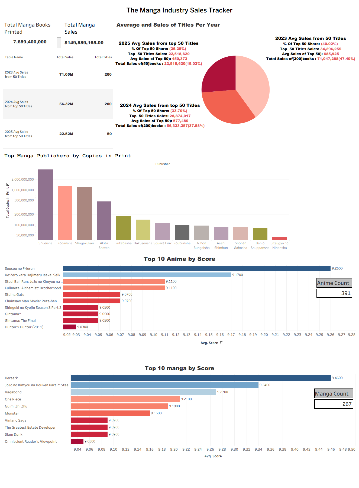

# 📚 The Manga Industry Sales Tracker & Analytics Dashboard

## Overview
An end-to-end data project analyzing global manga circulation, annual sales trends, publisher dominance, and community popularity metrics. Data was extracted from **MangaCodex** and **MyAnimeList**, cleaned and aggregated using **Python (pandas)**, and visualized in an interactive Tableau dashboard.

## Dashboard Preview


## Key Dashboard Visualizations & Metrics
- **Executive KPIs**: Tracks macro-level industry metrics including **7.68B Total Books Printed** and **$149.88M+ Total Sales** extracted from MangaCodex.
- **Yearly Sales & Concentration**: Pie and table breakdown analyzing yearly sales performance and market concentration:
  - **2023 & 2024 Datasets**: Includes **200 titles each**, showcasing full-year broad market performance.
  - **2025 Dataset**: Focuses on a **50-title subset**, allowing for a direct comparative analysis against top-performing titles from previous years.
- **Top Manga Publishers by Copies in Print**: Bar chart ranking major publishers by total circulation, highlighting industry leaders like Shueisha, Kodansha, and Shogakukan.
- **Top 10 Anime by Score**: Ranked horizontal bar chart displaying highest-rated anime series (led by *Sousou no Frieren* at 9.2600) evaluated across a **391 Anime Count** subset from MyAnimeList.
- **Top 10 Manga by Score**: Ranked horizontal bar chart displaying highest-rated manga series (led by *Berserk* at 9.4600) evaluated across a **267 Manga Count** subset from MyAnimeList.

## Project Structure
- `Manga-Industry&FanFavorites-Tracker.twbx`: Packaged Tableau workbook containing the interactive visualizations.
- `fetch_data.py`: Python script utilizing `pandas` and `requests` to extract and structure metadata via the MyAnimeList API.
- `manga_top_circulation.csv`, `manga_yearly_totals_2023.csv`, `manga_yearly_totals_2024.csv`, & `manga_yearly_totals_2025.csv`: Cleaned datasets generated via Python data pipelines using data from **MangaCodex**.
- `master_anime_warehouse.csv` & `master_manga_warehouse.csv`: Cleaned datasets generated via Python data pipelines using data from **MyAnimeList**.

## Technical Requirements
To run the Python scripts, you need:
- Python 3.x
- Required libraries: `pandas`, `requests`, `python-dotenv`
- A local `.env` file containing your MyAnimeList Client ID:
  ```env
  MAL_CLIENT_ID="YOUR_CLIENT_ID_HERE"
